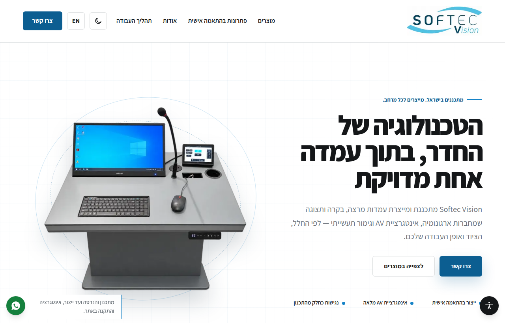
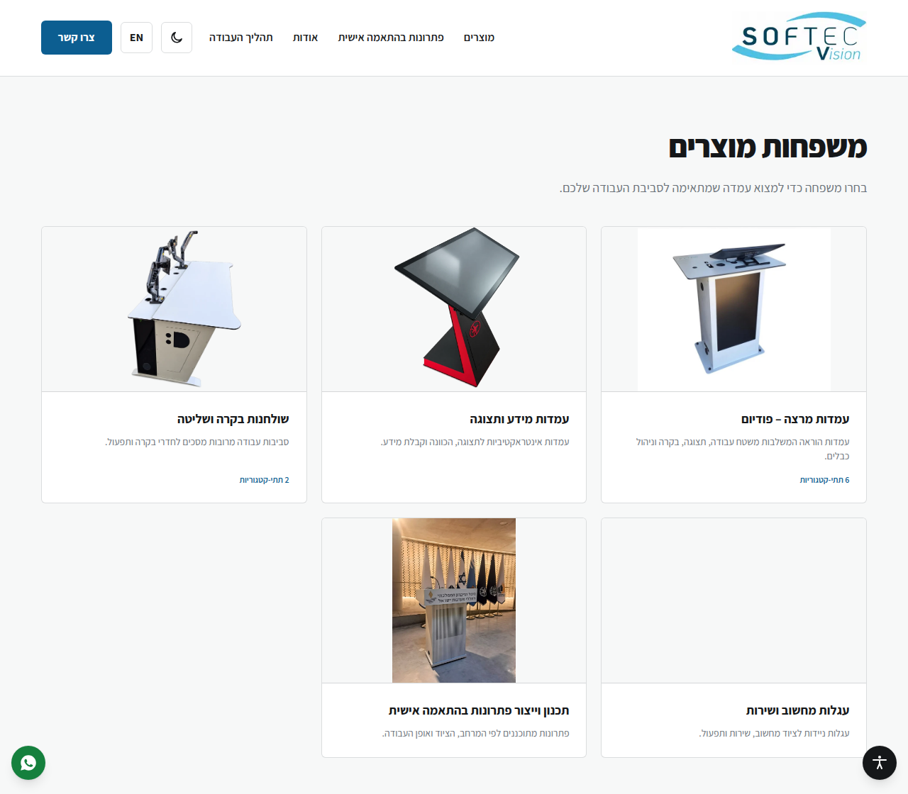
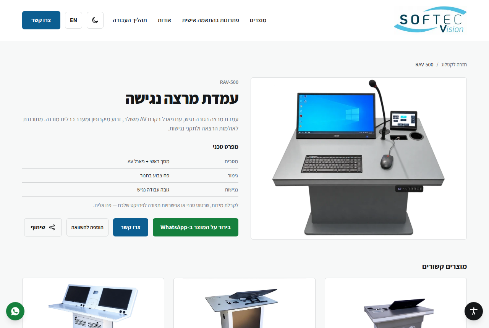
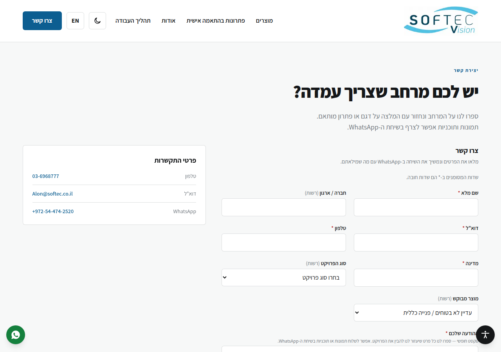
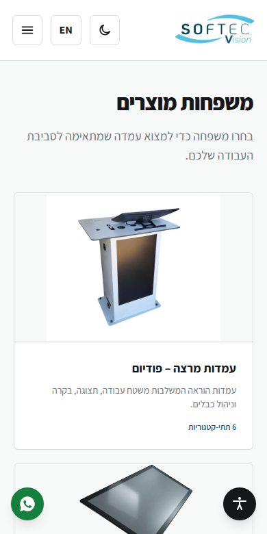

# Softec Vision — Web platform (Next.js + Supabase)

The production site: a bilingual (Hebrew/English) product catalog and quote-request platform for
Softec Vision Ltd, with a Supabase-backed owner admin. Live at `softecvision.vercel.app`.

**Stack:** Next.js 15 (App Router, RSC) · TypeScript · Tailwind CSS · next-intl (he/en, RTL/LTR) ·
Supabase (Postgres + Auth + Storage) · Vercel.

## Screenshots

| Home | Catalog |
| --- | --- |
| [](docs/screenshots/home-desktop.png) | [](docs/screenshots/catalog-desktop.png) |

| Product | Contact |
| --- | --- |
| [](docs/screenshots/product-desktop.png) | [](docs/screenshots/contact-desktop.png) |

<p align="center">
  
  <br />
  <em>Catalog on mobile — each family leads with a photo; product rows swipe horizontally.</em>
</p>

Screenshots show the Hebrew (RTL) site in light mode. Regenerate them with
`node docs/screenshots/shoot.mjs` against a local `npm run start` (see the script header).

## What's here

- **Public catalog** — categories/subcategories, product pages (specs, gallery, optional 3D
  model), a 2–3 product comparison, related products. Text and specs are editable from the admin
  (Supabase); product photos too (see below). Falls back to the built-in catalog seed if Supabase
  isn't configured or is unreachable, so the site is never taken down by a database outage.
- **Quote-request workflow** — a validated multi-field form with an optional file attachment,
  spam protection and privacy consent, stored in Supabase and (optionally) emailed. WhatsApp
  stays available as a fast secondary contact route everywhere.
- **Owner admin** (`/admin`, Supabase Auth + Row Level Security — see `supabase/migrations/`):
  - **Dashboard** (`/admin`) — at-a-glance overview: open inquiries, catalog completeness, how
    much site content has been customized, linking into each section below.
  - **Inquiries** (`/admin/inquiries`) — review, filter by status, reply shortcuts, permanent
    erasure for privacy requests.
  - **Products** — edit name/description/alt text/specs (bilingual) and publish status; one-time
    import of the built-in catalog into the database.
  - **Product photos** — replace or remove a product's primary image, add/remove gallery images.
    Uploaded photos (Supabase Storage, bucket `product-media`) take priority over the built-in
    seed image; with nothing uploaded, the site keeps showing the built-in photo.
  - **3D model** — upload a glTF Binary (`.glb`, up to 20MB) per product (Supabase Storage,
    bucket `product-models`). When present, the product page shows a Photos/3D tab; the model is
    only fetched (and the viewer library only loaded) if a visitor opens the 3D tab.
  - **Site content** (`/admin/content`) — edit the homepage hero and capability labels,
    bilingually, without a code change. A field left blank falls back to the shipped copy — not a
    blank section on the live site.
- **Light/dark theme**, a toggle in the header and admin, defaulting to the visitor's OS
  preference and persisted per visitor.
- **Accessibility** — a floating widget (text size, contrast, motion, reading aids, and more) as
  a genuine aid on top of a site built to WCAG 2.2 AA; mobile nav, focus management, keyboard and
  reduced-motion support throughout.
- **SEO/AEO** — canonical + hreflang on every page, sitemap/robots, Open Graph images per locale,
  Organization/WebSite/Product/BreadcrumbList JSON-LD.
- **Consent-gated analytics** — Google Consent Mode v2, Global Privacy Control honored, nothing
  loads before consent (or at all, while `NEXT_PUBLIC_GA4_ID` is unset).

See [`docs/platform/technical-spec.md`](../docs/platform/technical-spec.md) and
[`docs/platform/implementation-plan.md`](../docs/platform/implementation-plan.md) for the
original design docs, and [`docs/owner-facts-needed.md`](../docs/owner-facts-needed.md) for
business facts still needed from the owner (and how to run the database migrations).

## Develop

```bash
cd web
npm install
cp .env.example .env.local   # fill in once a Supabase project exists — see below
npm run dev                  # http://localhost:3000  → redirects to /he
npm run build                # production build
npm run typecheck            # tsc --noEmit
npm run lint
npm run test                 # vitest — unit tests for the pure/shared logic
```

Real-browser tests (catalog flows, mobile nav, consent flows, the accessibility widget, dark
mode) live at the repo root under `tests/` and use Playwright against a production build:

```bash
cd ..                                  # repo root
npm run build && npx next start -p 3400 -C web   # or: (cd web && npm run build && npx next start -p 3400 &)
NODE_PATH=/path/to/global/node_modules node --test tests/*.test.cjs
```

Playwright is intentionally not a project dependency — point `NODE_PATH` at wherever it's
installed, and make sure a Chrome/Chromium binary is reachable.

## Environment

See `.env.example` for every variable and what it's for. Public (`NEXT_PUBLIC_*`) values are
browser-safe and constrained by Row Level Security; `SUPABASE_SERVICE_ROLE_KEY` and any SMTP/API
secrets are **server-only** — never referenced from client code, never prefixed `NEXT_PUBLIC_`.
`NEXT_PUBLIC_GA4_ID` stays empty until launch — no analytics loads or requests until it is set,
and consent still gates it even then.

Without `NEXT_PUBLIC_SUPABASE_URL`/`NEXT_PUBLIC_SUPABASE_ANON_KEY` set, the site runs fully off
the built-in catalog seed (no admin, no quote-form persistence, no owner photo/content
overrides) — useful for local UI work with zero setup.

## Database (Supabase)

Migrations live in `supabase/migrations/`, applied in order via the Supabase CLI or the SQL
editor. They set up the catalog/CMS schema, Row Level Security (public reads published content
only; any signed-in staff member manages it; erasure is admin-only), the quote-request tables and
its private attachments bucket, and the public `product-media`/`product-models` Storage buckets
the admin's photo and 3D-model uploads use. Re-running a migration is safe — every statement is
idempotent (`create ... if not exists`, `on conflict do nothing/update`).

## Deploy (Vercel)

Set the project **Root Directory** to `web`, add the env vars, and connect the repo. Preview
deployments are created per branch/PR.
